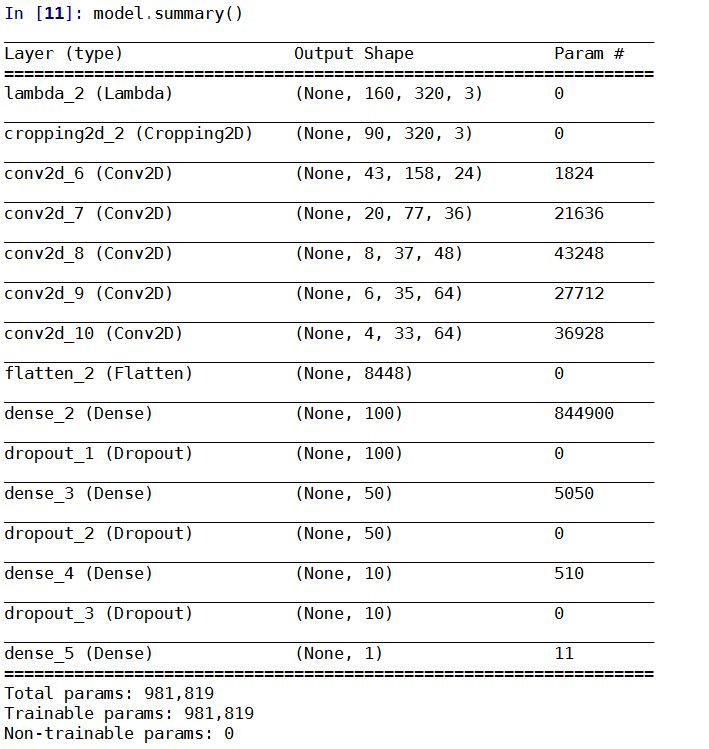

# **Behavioral Cloning** 

---

**Behavioral Cloning Project**

The goals / steps of this project are the following:
* Use the simulator to collect data of good driving behavior
* Build, a convolution neural network in Keras that predicts steering angles from images
* Train and validate the model with a training and validation set
* Test that the model successfully drives around track one without leaving the road
* Summarize the results with a written report


[//]: # (Image References)

[image1]: ./examples/placeholder.png "Model Visualization"
[image2]: ./examples/placeholder.png "Grayscaling"
[image3]: ./examples/placeholder_small.png "Recovery Image"
[image4]: ./examples/placeholder_small.png "Recovery Image"
[image5]: ./examples/placeholder_small.png "Recovery Image"
[image6]: ./examples/placeholder_small.png "Normal Image"
[image7]: ./examples/placeholder_small.png "Flipped Image"

## Rubric Points
### Here I will consider the [rubric points](https://review.udacity.com/#!/rubrics/432/view) individually and describe how I addressed each point in my implementation.  

---
### Files Submitted & Code Quality

#### 1. Submission includes all required files and can be used to run the simulator in autonomous mode

My project includes the following files:
* model.py containing the script to create and train the model
* drive.py for driving the car in autonomous mode
* model.h5 containing a trained convolution neural network 
* writeup_report.md or writeup_report.pdf summarizing the results

#### 2. Submission includes functional code
Using the Udacity provided simulator and my drive.py file, the car can be driven autonomously around the track by executing 
```sh
python drive.py model.h5
```

#### 3. Submission code is usable and readable

The model.py file contains the code for training and saving the convolution neural network. The file shows the pipeline I used for training and validating the model, and it contains comments to explain how the code works.

### Model Architecture and Training Strategy

#### 1. An appropriate model architecture has been employed

I am using nVidia Autonomous Car Group model, and the car can drive the complete first track. 

More details please see below sections.

#### 2. Attempts to reduce overfitting in the model

* The model contains dropout layers in order to reduce overfitting (model.py lines 91, 93, 95). 
* I keep the training epochs low: only three epochs.
* The model was trained and validated on different data sets to ensure that the model was not overfitting (code line 108). The model was tested by running it through the simulator and ensuring that the vehicle could stay on the track.

#### 3. Model parameter tuning

The model used an adam optimizer, so the learning rate was not tuned manually (model.py line 122).

#### 4. Appropriate training data

Training data was chosen to keep the vehicle driving on the road. I used a combination of center lane driving, recovering from the left and right sides of the road (model.py line 40~49)


### Model Architecture and Training Strategy

#### 1. Solution Design Approach

I am using nVidia Autonomous Car Group model, which would be one of the best choice for this case.

And at the beginning of the Network, I do some pre-processing: 
* A new Lambda layer was introduced to normalize the input images to zero means
* Another Cropping layer was introduced

The final step was to run the simulator to see how well the car was driving around track one. 

During the testing, the performance on the first track is fine (please download `/videos/video.mp4`), but not good on the second track. To improve the driving behavior further, I would like to collect more training data from the second track and re-train the model.  


#### 2. Final Model Architecture

The final model architecture is as below:  




#### 3. Creation of the Training Set & Training Process

I am using a `generator` function (model.py lines 53~74) to augment the data set (Generator is a great way to work with large amounts of data. Instead of storing the preprocessed data in memory all at once). 

I also flipped images and angles (model.py lines 68, 69)

Then I randomly shuffled the data set and put 20% of the data into a validation set. 

